# The Python Quiz

## Python Quiz Overview

The Python Quiz is a quiz designed to be representative of studies undertaken for a python project and is a learning vehicle to recap on information garnered in the form of a quiz. The quiz contains information on python and has various trivia questions relating to the programming language. It is designed to test the knowledge of those who have studied python and also who those who enjoy coding and quizzing in a general sense.
  

The quiz concept is a well-known one and its purpose is for people of all ages to interact with it. Familiarity and useability are key constructs for the quiz and it also serves to provide a fun experience for those who want to know if their knowledge is up to scratch in python. 
  

The quiz opens with a greeting, offering two options - a <em>Start Quiz</em> or <em>Instructions</em> option. The Instructions page gives simple instructions on how to complete the quiz and what the user will come to expect. On the Instructions page it indicates there are 10 questions available for users to attempt. It shows instructions on how to start the quiz and how many correct questions will be totted up upon conclusion of the quiz.
  

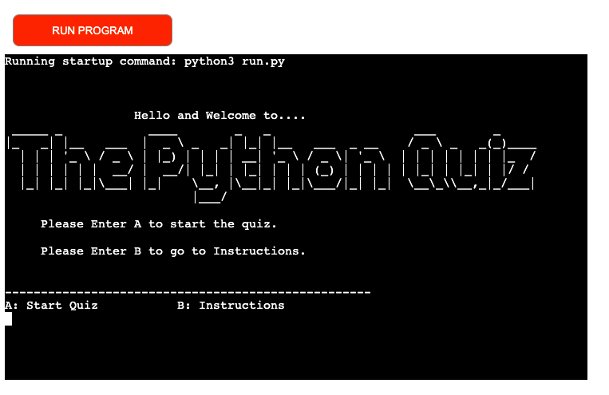

 

# Planning Stage
 

## Identifying a Target Audience
 

* People who have a keen interest in quizzes, particularly aligned to that of programming languages.

* People who are interested in testing their knowledge of Python.

* People who have a penchant for getting to know fun facts relating to a history-defining programming language.

  

# User Stories
 

## First-time Visitors

 

* The terminal should display immediate information about the subject matter of the quiz.

* The terminal should deploy effectively and be easily navigable for visitors to get started in taking part in the quiz.

* The site should provide inspiration for a visitor who is interested in all things related to programming languages, not least to answer the questions, but also to provide a foundation of interest for a user looking to understand the mechanics of the project deployment.

 

## Returning Visitors & Future Features

 

* For returning visitors it would be good to have a larger bank of questions for a user to test themselves. This would further promote learning of languages they are passionate about.

 

 

# Design

 

## Application Workflow Chart

 

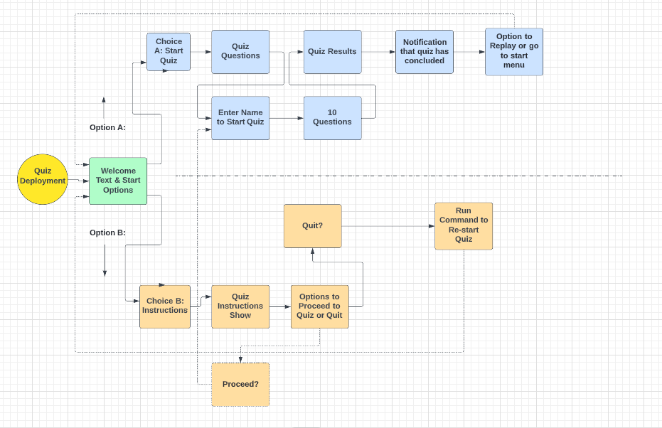

 

 

# Features

 

## The Start & Welcome Page

 

  * The Start Page consists of ASCII Welcome text with an option to start the quiz or open up details on instructions about the quiz. 

  * After the Welcome text, start quiz, and instruction options the quiz prompts a user to enter their name which requires characters between A-Z only.

    

   

   

  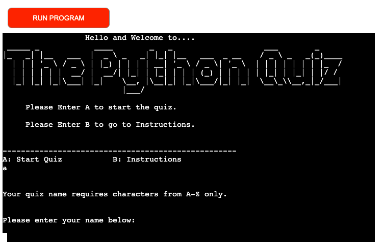

    

  ## The Instructions Page

   

  * The Instructions Page consists of the primary details and instructions on how to take part in the quiz.

  * It gives options to proceed or to quit the quiz should one require to do so.

    

  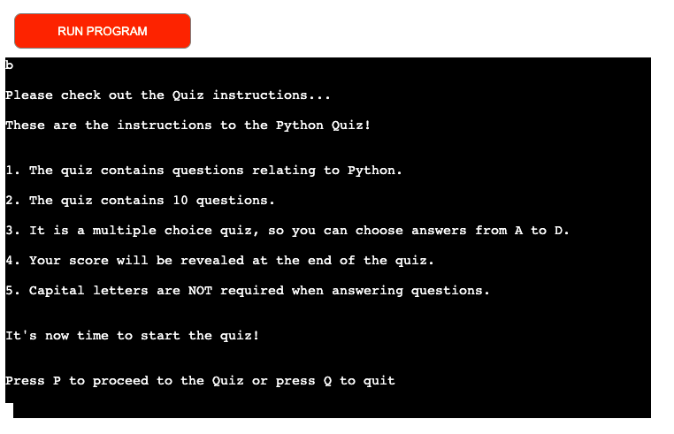

    

  ## The Quiz Page

   

  * The Quiz Page is where a bank of 10 questions on Python are compiled and rendered.

  * The questions are multiple choice with 4 options (A - D) to choose from.

    

  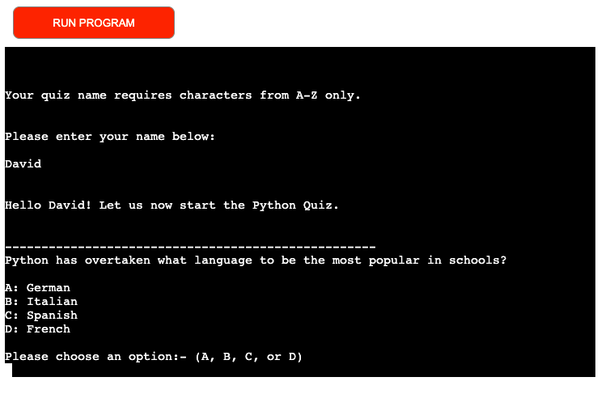

    

  ## Quiz Conclusion Page

   

  * The Quiz Conclusion Page renders in a similar fashion to the Start Page where more ASCII text indicates that the game has concluded. It denotes the end of the quiz and extends a thank you to the player.

  * It offers the option to replay or quit the quiz.

    

  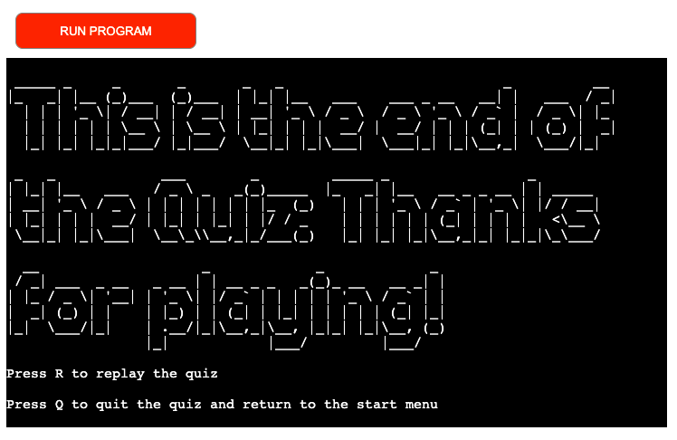 

    

  # Testing

   

  * Testing the deployment was rigorous and intricate to varying degrees. In terms of it being a quiz, it was not only just a requirement to accept users answers and move forward to completion. As the screenshot example shows, it was a requirement to pen code to highlight invalid entries and indicate this with invalid output warnings. This is a  fundamental requirement for all users.

    

  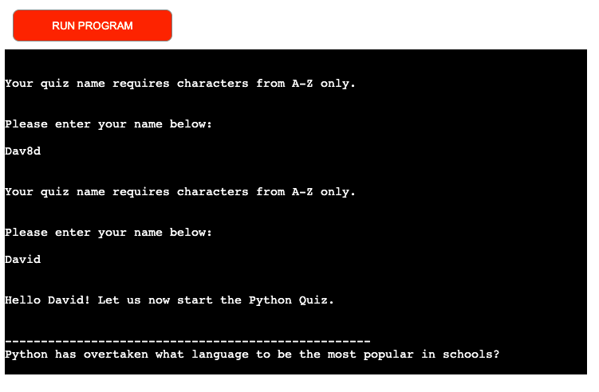 

   

  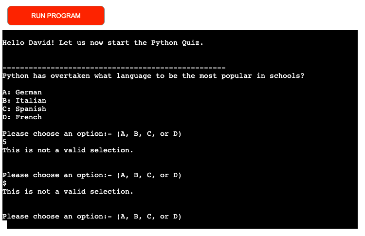

    

  * By design, code was compiled to omit a requirement for capital letters to answer questions in the quiz. I felt it complimented the general flow of a quiz typically and it negated against invalid text errors being commonplace. This was something I felt would take away from the quiz flow and concept as a whole.

    

  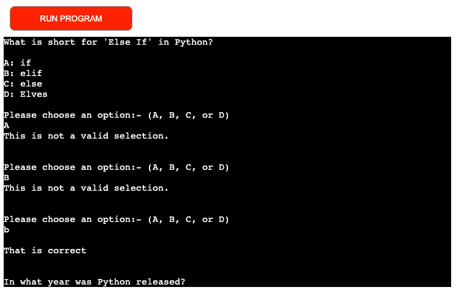

      

  # Validation

   

  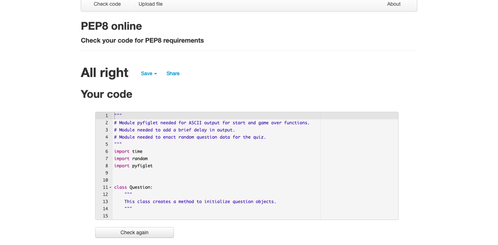

  * No errors were recorded when entered into the official PEP8 Python Validator.

    

  # Future Features

  * Include a feature that compiles and documents a High Score for users with the use of an API as per the Love Sandwiches project.

    

  # Bugs

   

  * I experienced bugs when attempting to deploy the project to Heroku. In the aftermath of security compromises on Heroku, login and dashboard functionality was rendered unusable. Deployment needed to be actioned via the terminal. Command line steps were adopted to deploy the project, but issues arose here. Linking to the workspace was achieved but the deployment of the project wasn't successful. The command <em>git push heroku main</em>, was the last command required as per advice in deployment, but it took several attempts to get this to function. Logging out of all applications and re-entering the same command line text proved to get the project working in a satisfactory way. No further issues arose since the initial successful deployment.

  * Early in post-completion of the project code I did have some issues with the Instructions Page, primarily with the options to **Proceed** or **Quit** and the subsequent <em>Invalid Option</em> when both keys **P** or **Q** were not entered as requested. The screenshot indicates the required flow expected below. The initial bug (when the requested keys weren't inputted) yielded a loop back to the Start Page again. Mistakenly the Start Page function had found it's way into that block of code and was reason for the disruption in flow and a premature re-start of the quiz.

    

  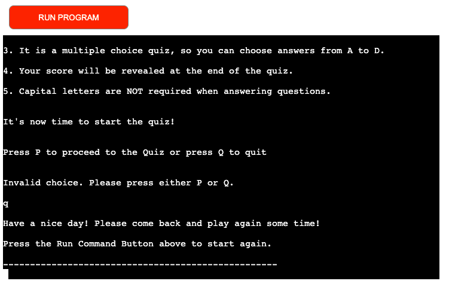

    

  # Unfixed Bugs

   

  * There were no unfixed bugs that were detected or proved to break the flow of the application.

    

  # Deployment

   

  * The project was deployed to Heroku in the following manner:

    * Sign into the Heroku website.
    * Select New, Create New App.
    * Assign a name for the App: python-quiz-project-p3.
    * Assign a Region: Europe.
    * Navigate to Settings to add Buildpacks of Python and Node.js.
    * Navigate to Deploy, Deployment Method and choose GitHub.

     

    At the time of completing the project Heroku was compromised in a security attack, denying users the ability to deploy via the dashboard. The prevailing fix was to deploy the application from the terminal as follows:

    * Run the command heroku login -i and login when prompted. 
    * Run the command heroku git: remote - a python-quiz-project-p3 to create a new app with the aforementioned name as an example. 
    * This will create a new Heroku app and link it to the Gitpod terminal. 

     

    There were further bugs and issues related to this process, which are addressed in the Bugs section.

     

    You can find the live site here: [The Python Quiz](https://python-quiz-project-p3.herokuapp.com/)

      

    # Content & Media

     

    The content and media used during the project was sourced and referenced as follows:

     

     * Lucid Flow Chart [Lucid](https://pixlr.app)
     * Knowledge Base [W3Schools](https://www.w3schools.com/)
     * Heroku Deployment Platform [Heroku](https://www.heroku.com)
     * Python Quiz Game [YouTube](https://www.youtube.com/watch?v=yriw5Zh406s)
     * Python For Beginners [YouTube](https://www.youtube.com/watch?v=kqtD5dpn9C8)
     * The Love Sandwiches Project by Anna Greaves